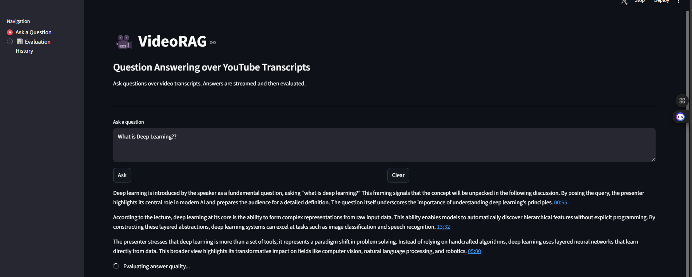
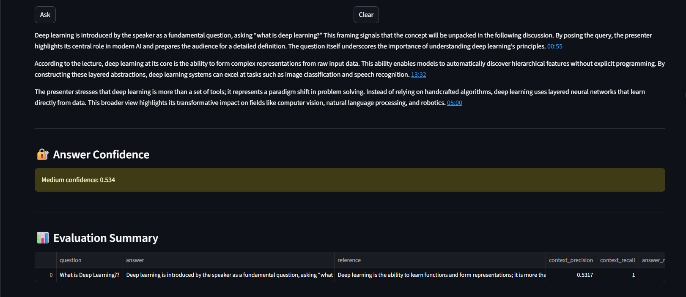
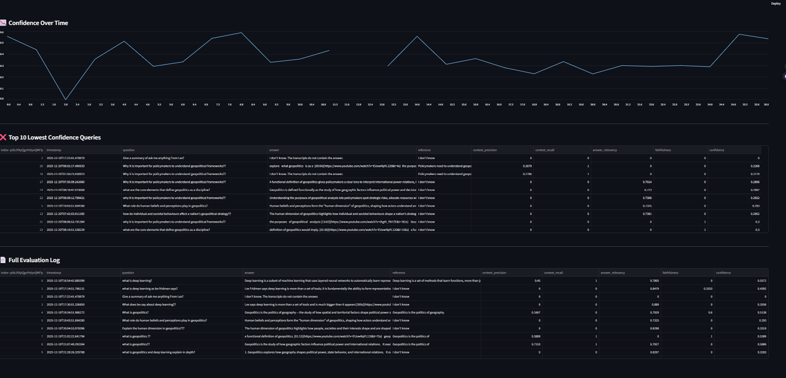
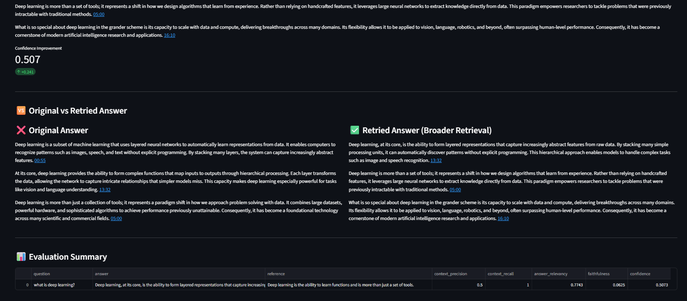

# 🎥 VideoRAG: Question Answering over YouTube Video Transcripts

VideoRAG is an **end-to-end Retrieval-Augmented Generation (RAG) system** that enables **grounded, timestamped question answering over YouTube videos**.
It ingests YouTube playlists, extracts transcripts with metadata, builds a **persistent vector database**, retrieves relevant context using **hybrid retrieval**, generates **strictly grounded answers**, and **automatically evaluates RAG quality** using industry-standard metrics.

The system also includes a **Streamlit frontend** with confidence tracking, retry mechanisms, and evaluation history for continuous improvement.

## 🔗 Live Demo (Streamlit App)

You can try the deployed **VideoRAG** application here:

👉 **https://videorag-app-system-for-youtube-videos-3vpsxvnappai2vxtpjgon3.streamlit.app/**

> ⚠️ **Note:** This is a demo deployment on **Streamlit Cloud**.  
> Answer evaluation can take longer (≈2–2.5 minutes) because it triggers **multiple sequential LLM calls** for RAG quality metrics and runs on **shared, rate-limited cloud infrastructure**.  
> See the *Evaluation Latency* section below for details.

---

## ⚠️ Important Usage Note (Read Before Asking Questions)

This application is a **content-grounded VideoRAG system**, not a general-purpose chatbot.

### 📌 What content is indexed?
Embeddings have been created **only for transcripts from a limited set of YouTube videos (currently 12 videos)**.  
The system can answer questions **only if the information exists explicitly in these transcripts**.

If you ask a question **outside the scope of this content**, the system will intentionally respond with:

> **"I don't know. The transcripts do not contain the answer."**

This behavior is **by design** to prevent hallucinations and ensure faithful, grounded answers.

---

### 🎥 Indexed YouTube Videos

Please ask questions **only related to the following videos** to get relevant and high-confidence answers:

- https://www.youtube.com/watch?v=wKw1tpN7NVE  
- https://www.youtube.com/watch?v=_ySbzVXiwzQ  
- https://www.youtube.com/watch?v=pXEl0R1BX-g  
- https://www.youtube.com/watch?v=KceRmxCnXDA  
- https://www.youtube.com/watch?v=l5Uw8qG7vZU  
- https://www.youtube.com/watch?v=GFB0o1QQyLw  
- https://www.youtube.com/watch?v=wuJa1lnv_TQ  
- https://www.youtube.com/watch?v=0VH1Lim8gL8  
- https://www.youtube.com/watch?v=O5xeyoRL95U  
- https://www.youtube.com/watch?v=EUowNpYL120  
- https://www.youtube.com/watch?v=tXgtV_P87ZE  
- https://www.youtube.com/watch?v=w7mTuL1hfzA  

---

### 💡 Recommended Questions to Try

To see VideoRAG perform at its best, try asking **questions that are explicitly discussed in the indexed videos** listed above.

**🎓 Concepts & Explanations**
- What possibilities of deep learning does the speaker say it can bring to the world?
- What is geopolitics?
- What does the speaker say about learning representations from data?  
- How are neural networks explained in the context of real-world problems?

**🧠 Philosophy & Thinking**
- What is said about discipline and consistency in learning or research?  
- How does the speaker approach long-term thinking and progress?  
- What mindset is recommended for mastering difficult technical subjects?

**🛠️ Practical Advice**
- What advice is given for beginners entering machine learning or AI?  
- How does the speaker suggest dealing with failure or confusion while learning?  
- What role does practice play according to the speaker?

**🔍 Reflections & Insights**
- What does the speaker say about the future of AI or machine learning?  
- How is problem-solving framed in the context of complex systems?  
- What habits or routines are emphasized for sustained improvement?

---

### ⚠️ Reminder
If you ask questions **outside the scope of the indexed videos**, the system will intentionally respond with:

> **"I don't know. The transcripts do not contain the answer."**

This indicates that the system is **avoiding hallucination by answering only from verified transcript context**.

---

## 🚀 Key Features

* **YouTube Playlist Ingestion**
  * Extracts video URLs and metadata using `yt-dlp`
  * Deduplicates videos across runs

* **Transcript Extraction**
  * Fetches English transcripts line-by-line
  * Preserves timestamps for precise citations
  * Incremental processing (no rework on already processed videos)

* **Cost-Efficient Embedding Pipeline**
  * Uses SHA-256 hashing to detect duplicate text
  * Reuses embeddings when transcript text is identical
  * Avoids unnecessary calls to embedding APIs

* **Persistent Vector Store**
  * ChromaDB for disk-backed persistence
  * Designed for long-term usage and incremental updates

* **Hybrid Retrieval Strategy**
  * **MMR Retriever** → relevance + diversity
  * **Multi-Query Retriever** → handles ambiguous queries
  * **BM25 Retriever** → keyword-based lexical search
  * Automatic deduplication across retrievers

* **Strictly Grounded Answer Generation**
  * Answers ONLY from retrieved transcript chunks
  * Clickable YouTube timestamps for every answer
  * Hallucination-resistant prompt design

* **RAG Evaluation**
  * Evaluated on:
    * Context Precision
    * Context Recall
    * Faithfulness
    * Answer Relevancy
  * Confidence score computed with weighted metrics
  * Low-confidence answers automatically logged

* **Interactive Frontend**
  * Streamlit UI with streamed answers
  * Confidence visualization (high / medium / low)
  * Retry on low confidence with re-evaluation
  * Evaluation history dashboard

---

## 🖥️ Streamlit Interface Walkthrough

Below is the end-to-end Streamlit interface for **VideoRAG**, demonstrating question answering, automatic RAG evaluation, and evaluation history tracking.

### 1️⃣ Question Answering over YouTube Transcripts
Users ask questions over video transcripts.  
The system retrieves relevant context, generates grounded answers, and provides clickable timestamps.

<p align="center">
  
</p>

---

### 2️⃣ RAG Evaluation (RAGAS)
Each answer is evaluated using **RAGAS** on context precision, context recall, faithfulness, and answer relevancy.  
A confidence score is computed to assess answer reliability.

<p align="center">
  
</p>

---

### 3️⃣ Evaluation History & Monitoring
Low-confidence answers are logged and visualized over time, enabling continuous monitoring and debugging of the RAG system.

<p align="center">
  
</p>

---

### 4️⃣ Retry, Confidence Improvement & Answer Comparison

When an answer receives a low confidence score, users can **retry the same question**.  
Retry triggers a fresh retrieval pass, often surfacing more explicit or better-grounded context.

The interface highlights:
- **Confidence improvement** after retry
- **Side-by-side comparison** of the original vs retried answer
- **Updated RAGAS evaluation metrics** reflecting improved grounding

This makes retrieval instability transparent and demonstrates how improved context directly impacts answer faithfulness and confidence.

<p align="center">
  
</p>

---

## 🧠 System Architecture
```
YouTube Playlist
      ↓
Metadata Extraction (yt-dlp)
      ↓
Transcript Extraction (youtube-transcript-api)
      ↓
CSV → LangChain Documents
      ↓
Embedding + Deduplication (Gemini)
      ↓
ChromaDB (Persistent Vector Store)
      ↓
Hybrid Retrieval (MMR + MultiQuery + BM25)
      ↓
LLM Answer Generation (Groq)
      ↓
RAGAS Evaluation/Generate an audio
      ↓
Streamlit Frontend + Logs
```

---

## 🛠️ Tech Stack

**Languages & Frameworks**
* Python
* Streamlit

**LLMs & Embeddings**
* Google Gemini (`text-embedding-004`)
* Gemini 2.5 Flash (multi-query generation)
* Groq (`openai/gpt-oss-120B`) for answer generation & evaluation

**RAG & Retrieval**
* LangChain
* ChromaDB
* BM25 Retriever
* MultiQuery Retriever
* MMR Retriever

**Text-to-Speech**
* Piper (offline, local)
* gTTS (cloud deployment)

**Evaluation**
* RAGAS

**Data Handling**
* Pandas
* CSV-based incremental pipelines

---

## 📁 Project Structure
```
.
├── youtube_meta_data.py
├── transcript_generate.py
├── doc_loader.py
├── vector_store_chroma.py
├── retriever_pipeline2.py
├── evaluation_pipeline.py
├── frontend1.py
├── logs/
│   ├── app.log
│   └── rag_evaluation_log.csv
├── chroma_db/
├── README.md
└── assets/
```

---

## ⚙️ Setup & Installation

### 1️⃣ Clone the Repository
```bash
git clone https://github.com/your-username/VideoRAG.git
cd VideoRAG
```

### 2️⃣ Install Dependencies
```bash
pip install -r requirements.txt
```

### 3️⃣ Environment Variables

Create a `.env` file:
```env
GOOGLE_API_KEY=your_google_api_key
GROQ_API_KEY=your_groq_api_key
```

---

## 🔊 Text-to-Speech (TTS) Support

VideoRAG includes **spoken answer generation** using a **dual Text-to-Speech (TTS) backend** that automatically adapts to the execution environment.

The system selects the appropriate TTS engine **without any manual configuration**, ensuring smooth local development and cloud deployment.

---

### 🔁 Automatic TTS Backend Selection

| Environment | TTS Engine | Why |
|------------|-----------|-----|
| **Local machine** | **Piper (Offline TTS)** | Fast, high-quality, fully offline,No API required |
| **Streamlit Cloud** | **gTTS (Google Text-to-Speech)** | Cloud-safe, no native binaries required |

The UI clearly displays the active mode:
```
🔊 TTS Mode: Piper (Local)
```
or
```
🔊 TTS Mode: gTTS (Cloud)
```

---

## 🖥️ Local Setup: Piper (Offline Text-to-Speech)

Piper is used **only in local environments**, as Streamlit Cloud does not allow native binaries.

### 1️⃣ Download Piper

Download the latest Piper release from the official repository:

**https://github.com/rhasspy/piper/releases**

Extract the files to the following directory (Windows):
```
D:\piper\
```

Your folder should contain:
```
D:\piper
├── piper.exe
├── en_US-lessac-medium.onnx
```

---

### 2️⃣ Verify Piper Installation

Run:
```bash
D:\piper\piper.exe --help
```

If the help menu appears, Piper is installed correctly.

---

### 3️⃣ Install FFmpeg (Required)

Piper outputs WAV audio, which is converted to MP3 using FFmpeg.

Download FFmpeg (Windows static build):

**https://www.gyan.dev/ffmpeg/builds/**

Add FFmpeg to your system PATH, then verify:
```bash
ffmpeg -version
```


## ☁️ Streamlit Cloud Setup: gTTS (Google Text-to-Speech)

Streamlit Cloud does not support native executables like Piper.  
To ensure compatibility, VideoRAG automatically switches to gTTS when deployed.

### Cloud TTS Behavior

On Streamlit Cloud:

-   Piper is unavailable
-  gTTS is used automatically
-  Audio is generated directly as MP3
-  No additional setup or environment variables are required

## ⚠️ Known Limitations

- gTTS requires an active internet connection
- Piper is currently configured for English voices only

## ▶️ Running the Pipeline

### Step 1: Extract Video Metadata
```bash
python youtube_meta_data.py
```

### Step 2: Generate Transcripts
```bash
python transcript_generate.py
```

### Step 3: Build / Update Vector Store
```bash
python vector_store_chroma.py
```

### Step 4: Launch Frontend
```bash
streamlit run frontend1.py
```

---

## 📊 Evaluation Methodology

VideoRAG evaluates each answer using **RAGAS** on:

| Metric            | Description                                |
| ----------------- | ------------------------------------------ |
| Context Precision | Measures noise in retrieved context        |
| Context Recall    | Measures coverage of required information  |
| Faithfulness      | Checks grounding to retrieved context      |
| Answer Relevancy  | Measures how well the question is answered |

A **custom confidence score** is computed with higher weight on faithfulness to discourage hallucinations.

Low-confidence answers are automatically logged for inspection and improvement.

---

### ⏱️ Evaluation Latency on Streamlit Cloud

Because this app is deployed on **Streamlit Cloud (shared infrastructure)**, evaluation may take:

> ⏳ **~2–2.5 minutes per evaluation**

This latency is expected and caused by:
- Multiple sequential LLM calls per metric
- Rate limits on hosted LLM providers
- Cold starts on shared cloud resources

⚠️ **Important:**  
This does **not** affect answer generation speed.  
Only the **evaluation phase** is slow.

In a production or self-hosted environment, evaluation latency can be reduced significantly by:
- Using smaller evaluation models
- Running evaluation asynchronously
- Moving evaluation to offline or batch pipelines

---

## 🎯 Design Decisions

* **No Text Splitter**  
  Transcripts are already timestamped line-by-line. Further splitting would break temporal grounding.

* **Hash-Based Deduplication**  
  Prevents repeated embedding generation → saves cost and time.

* **Hybrid Retrieval**  
  Combines semantic, lexical, and query-expansion techniques for robust recall.

* **Strict Prompt Constraints**  
  Forces grounded, timestamped, multi-sentence answers only from context.

* **Evaluation-Driven Development**  
  RAG quality is continuously measured, logged, and improved.

* **Capability-Based TTS Selection**  
  Automatically switches between Piper (local) and gTTS (cloud) without manual configuration.

---

## 🔮 Future Improvements

* Add multi-language transcript support
* Chunk-level reranking with cross-encoders
* User feedback loop integrated into evaluation
* Dockerized deployment
* Support for multiple playlists / domains
* Multi-language TTS support

---

## 📌 Use Cases

* Educational video search
* Podcast & lecture Q&A
* Research over long-form video content
* Knowledge extraction from YouTube channels

---